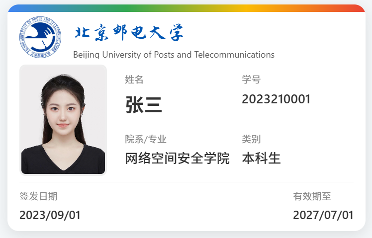
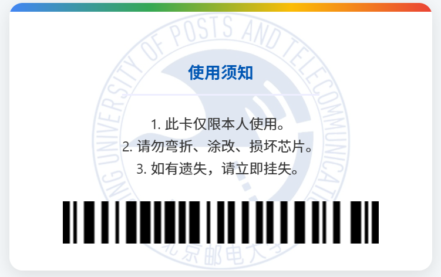

# 🎨 个性化校园卡定制器 (Personalized Campus Card Customizer)

本项目是一个纯前端实现的动态网页，允许用户实时自定义校园卡上的信息，并提供卡片正反面的 3D 翻转预览。

## 📸 效果预览

 
 

## ✨ 主要功能

* **实时预览:** 表单中的任何修改（姓名、学号、院系等）都会**实时**更新到左侧的卡片预览上。
* **3D 翻转:** 鼠标悬停在卡片上时，卡片会平滑地 3D 翻转，以展示卡片背面。
* **图片上传:** 支持实时上传个人照片和学校 Logo。
* **动态水印:** 上传的 Logo 会被自动用作卡片背面的背景水印。
* **响应式布局:** 页面在宽屏上为“预览/控制”双栏布局；在窄屏（如手机）上会自动切换为单栏堆叠布局。
* **自定义字体:** 通过 `@font-face` 引入外部字体文件，用于卡片上的艺术字体显示。
* **动态条形码:** 卡片背面的条形码会根据表单中的学号自动（通过外部 API）生成。

## 🛠️ 技术栈

本项目完全使用原生的 Web 技术构建，没有依赖任何框架。

* **HTML5:**
    * 使用语义化标签 (如 `<header>`, `<main>`, `<section>`, `<aside>`, `<footer>`) 构建页面结构。
    * 使用表单元素 (`<input>`, `<select>`, `<label>`) 进行数据交互。

* **CSS3:**
    * **CSS 变量 (Custom Properties):** 在 `:root` 中定义全局主题色、字体和尺寸，易于维护。
    * **Flexbox 布局:** 用于实现页面主体的双栏响应式布局 (`.container`)。
    * **Grid 布局:** 用于实现卡片正面个人信息的精密网格对齐 (`.card-info`)。
    * **3D Transforms & Transitions:** 核心的 3D 翻转动画 (`perspective`, `transform: rotateY()`, `backface-visibility`)。
    * **伪元素 (Pseudo-elements):** 用于创建卡片正反面的彩色条带 (`::before`, `::after`) 和动态水印。
    * **媒体查询 (Media Queries):** 用于在不同屏幕宽度下调整布局 (`@media`)。

* **JavaScript (ES6+):**
    * **DOM 操作:** 使用 `DOMContentLoaded`, `getElementById`, `querySelector` 监听和操作页面元素。
    * **事件监听:** 通过 `addEventListener` 实时响应 `input` 和 `change` 事件。
    * **FileReader API:** 用于异步读取用户上传的图片文件，并将其显示为 base64 格式的 `src`。
    * **CSS 变量操作:** 通过 `element.style.setProperty()` 动态修改 CSS 变量，实现背面水印的更新。

## 🚀 如何运行

这是一个纯静态网站项目，无需后端或复杂的构建步骤。

1.  克隆（Clone）或下载（Download ZIP）此仓库。
2.  在你的电脑上，直接用浏览器打开 `index.html` 文件即可查看。

## 🎓 作业考察点清单

本项目严格按照课程作业要求实现，覆盖了所有考察点：

* **✅ 文件组织:** 项目分为 `css/`, `js/`, `images/` 和根目录 `index.html`。
* **✅ HTML 结构:** 使用了完整的 HTML5 语义化结构。
* **✅ CSS 引用:** 使用了 `<link>` 标签引用外部样式表 `style.css`。
* **✅ 双栏布局:** 使用 `Flexbox` 实现，并在 `@media` 查询中切换为单栏。
* **✅ 盒模型:** 广泛使用 `padding`, `margin`, `border` 并通过 `box-sizing: border-box` 统一标准。
* **✅ 定位:** 综合使用 `position: relative` (父容器) 和 `position: absolute` (伪元素、卡片面)。
* **✅ 选择器:** 综合使用 ID、Class、元素、后代、伪类 (`:hover`, `:focus`) 和伪元素 (`::before`, `::after`)。
* **✅ 样式:** 涵盖了字体 (`@font-face`)、背景 (`linear-gradient`)、变换 (`transform`) 和动画 (`transition`)。
* **✅ 浏览器缩放/跨浏览器:** 使用 `em` 和 `rem` (在 :root 中定义) 确保相对缩放，并使用 `min-width` 保证最小可读性。